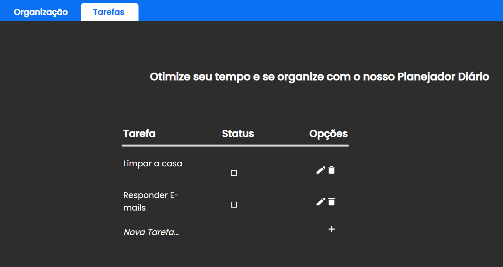

# Planejador Diário 📅

Este é um aplicativo de planejamento diário simples construído usando React ⚛️, rotas dinâmicas 🔄, SCSS 💅, JavaScript 📜 e Vite 🚀. 

Com este aplicativo, você pode criar ✍️, editar ✏️, excluir 🗑️ e marcar ✔️ tarefas como concluídas em seu planejador diário.

## Funcionalidades ✨
- Adicione novas tarefas ao seu planejador diário.
- Edite as tarefas existentes para atualizar informações.
- Marque as tarefas como concluídas.
- Exclua tarefas que não são mais necessárias.

## Instalação 🛠️
Certifique-se de ter o Node.js instalado em sua máquina.

## Clone este repositório:

### Copy code : 

- <i> git clone https://github.com/seu-usuario/planejador-diario.git </i>

### Acesse o diretório do projeto:

- <i> cd planejador-diario </i>

### Instale as dependências:

- <i> npm install </i>

### Inicie o servidor de desenvolvimento:

- <i> npm run dev </i>

Acesse o aplicativo em http://localhost:3000 no seu navegador.

## Uso 🚀

- Para adicionar uma nova tarefa, clique no botão "Adicionar Tarefa" e preencha os detalhes.
- Para editar uma tarefa, clique no botão "Editar" ao lado da tarefa e faça as alterações desejadas.
- Para marcar uma tarefa como concluída, clique na caixa de seleção ao lado da tarefa.
- Para excluir uma tarefa, clique no botão "Excluir" ao lado da tarefa.

## Estrutura do Projeto 📁

A estrutura do projeto é a seguinte:

- src / : Contém os arquivos fonte do aplicativo. 
- components / : Componentes React. 
- views / : Rotas do aplicativo. 
- scss /: Arquivos SCSS para estilização. 
- main.jsx : Ponto de entrada do aplicativo. 
- public / : Contém recursos públicos.

## Contribuição 🤝

Sinta-se à vontade para contribuir para este projeto. Você pode abrir problemas, enviar solicitações pull e ajudar a melhorar o aplicativo.